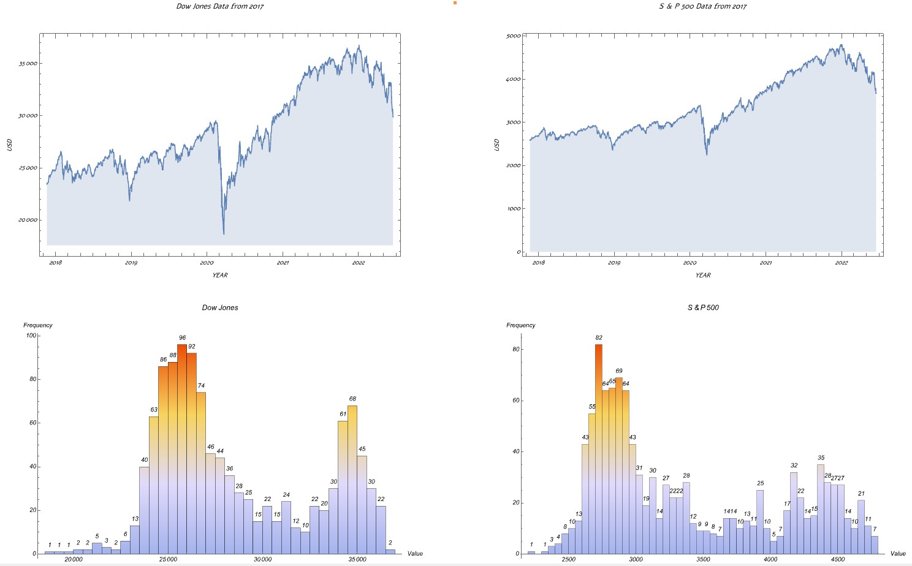
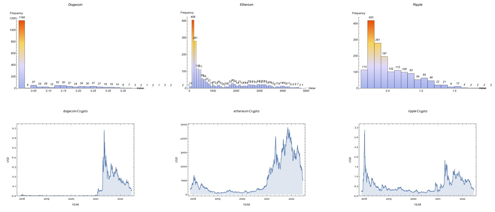
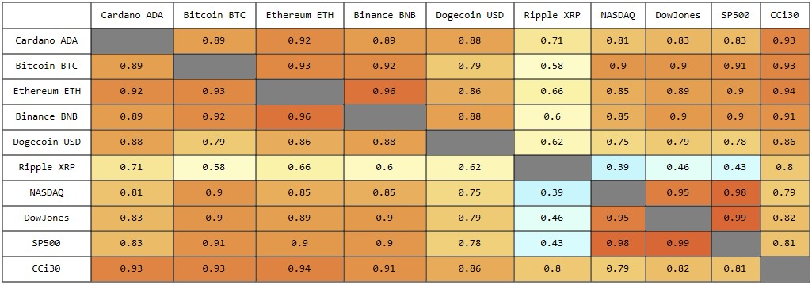
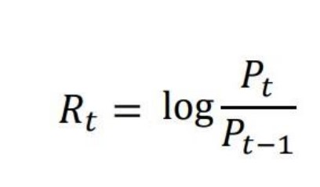
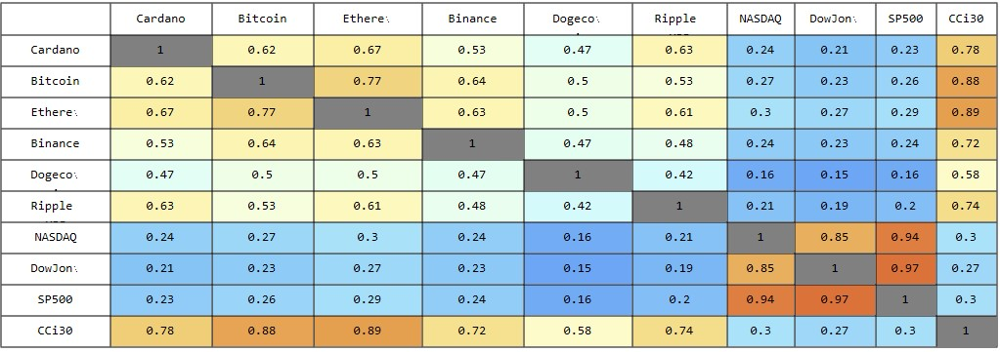
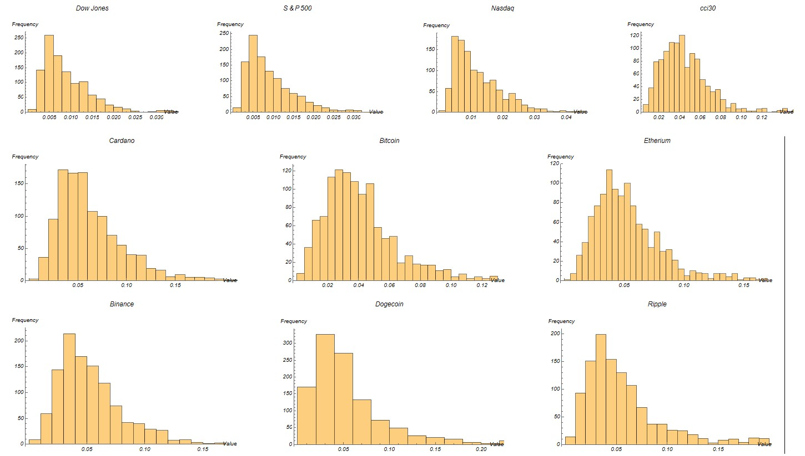
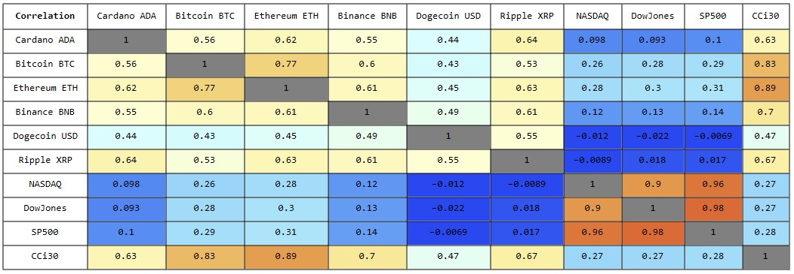
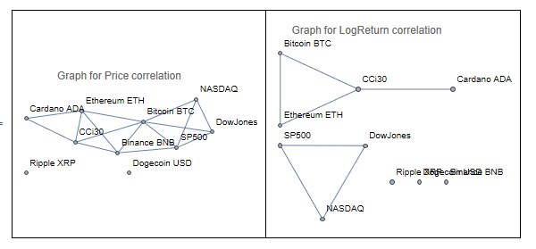
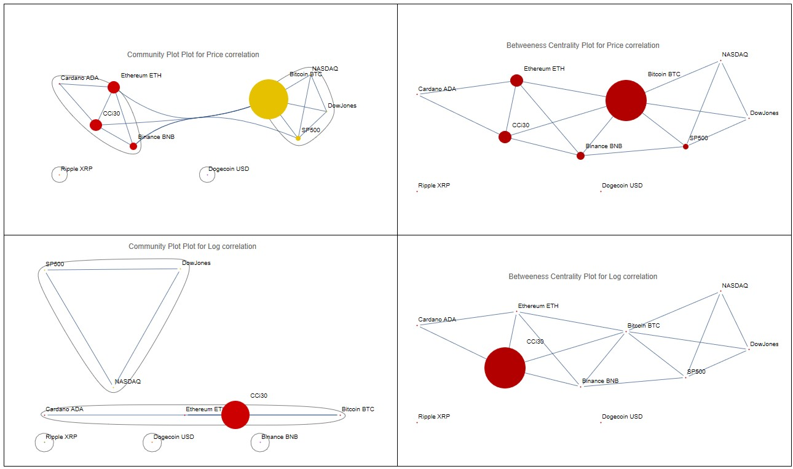

 # **NETWORK OF INFLUENCE ON THE STOCK MARKET AND ITS IMPACT ON RISK ANALYSIS**
### AMAL PAMBACKAL SEBASTIAN: AUGUST 2022

## **ABSTRACT**

The goal of this research is to better understand the relationships between cryptocurrencies and stock indexes, including how cryptocurrencies are interconnected. Preliminary visualization revealed a trend of market movement across all cryptocurrencies, indicating a substantial correlation. Initial analysis focusses on finding the correlation between the stock indexes and cryptocurrencies value returns. Another objective is to study the volatility of the asset value measured by standard deviation of each asset for a short period and to further calculate the correlation between them. In order to express relationships between assets in a pictorial format, graphs are used. The assets are represented by the graph vertices, and the relationships between them are shown by edges in the graph. Further, centrality is crucial in identifying important nodes. Two measures will be considered, Eigen-vector centrality (measuring likelihood of visitation to a node) and betweenness centrality (counting the instance in which counts the instances in which a node acts as a bridge facilitating the quickest and shortest route between two nodes). The tests were carried out on four indexes (three stock indexes and one crypto index) and six well-known cryptocurrencies based on the quantity and accessibility of historical trading data. The results of the research based on the time series of price returns, points to a strong relationship between Ethereum and Bitcoin in cryptocurrencies, but Dow Jones and S&P 500 have the strongest correlation when it comes to stock indices. The moving average of volatility showed that cci30 is highly volatile compared to other stock indexes and all six crypto currencies are highly volatile. The network graph demonstrates the interconnectedness and clustering of the selected cryptocurrency currencies. It’s evident that Bitcoin functions as a central node, which means it has the highest likelihood of appearing on a random path in the graph.

## **Introduction**

The core of investment is in-depth research and diversification, just as it is wise to not put all of the eggs in one basket. A balanced investing strategy incorporates many asset types into a portfolio. An investing plan that aims to strike a balance between capital preservation and growth is said to be balanced (Alok Kumar 2001). While more aggressive investors may choose growth methods, more conservative investors may choose capital preservation techniques.Recent claims that cryptocurrencies are a bubble (Forbes 2018) with little or no inherent value, their fluctuating prices, and suspicions that they may be used to avoid legal and regulatory scrutiny have all prompted public discussion regarding cryptocurrencies. The biggest innovative distinction between digital currencies and conventional fiat money is that the former creates a new distributed billing system based on encryption protocols that can guarantee the anonymity, cheap cost, and quick speed of peer-to-peer transactions (Bouri, E 2017a).

A well-known cryptocurrency at the moment is Bitcoin, which Satoshi Nakamoto (a pseudo name) developed in 2009. According to (Coinmarketcap 2022), by July 2022, the market capitalization of Bitcoin will have topped 422.12 billion USD.Another well-known cryptocurrency is Ethereum, which aims to leverage blockchain technology to power applications for tamper-proof decentralised financial contracts as well as to maintain a decentralised payment network (Investopedia). Vitalik Buterin wrote a concept paper for Ethereum in 2013 (Blockchainlab), and it became a functioning blockchain in 2015.

In contrast, BNB Smart Chain, is a new blockchain that seeks to assist developers in creating high-performance DApps. Although the fundamental technology of these currencies has not changed significantly, certain features of each currency will affect its values, volatility, and interconnections with other cryptocurrencies (Cointelegraph).

Despite the wide differences volume and amplitude variations between the stock market and the cryptocurrency economy, the same analytic methods may be used by normalizing their values time series by log-return and volatility time series. It’s crucial to understand how assets interrelate, characteristics of graphs representing the connectivity of stocks and cryptocurrencies, and whether there are significant nodes or clusters that are correlative, indicating assets that share similar characteristics. I examine the degree and edge weight distributions for this reason, as well as I also consider measures of centrality: eigen vector (Newman 2006) and in betweenness centralities (Freeman)The quantity to be measured is actually correlation and as a preliminary assumption having correlation is assumed as an indicator that information from one asset flows to the other.The advantages of diversification can generally be limited by a high level of volatility connectedness or spill overs among cryptocurrencies (ShuyueYia 2018).When the economy is experiencing high levels of volatility, traders can use the insights to modify their asset portfolios or develop investing strategies. In addition, since it is clear that some particular cryptocurrencies now dominate the market with their relatively high market cap (Yahoo finance), researching on and determining whether there is a dominating cryptocurrency is also an objective of this research.

Six cryptocurrencies have been chosen for empirical investigation using trade data in accordance with their market capitalisation and an estimate of their volatility connectivity in order to first gain a preliminary understanding of the market. With the aim of examining the similarities and differences between stock and cryptocurrency networks based on log-return(*~Log returns or continuously compounded rate of return, for instance consider a $10 stock that increased to $12 and then dropped back to $10. According to basic returns, you will have a 20% gain during the first time period and a 16.7% decline during the second. Even though you didn't make any money at all, if you just sum them up or even take an average, you will have a total return of 3.3 percent and an average return of 1.7 percent. However, as log returns are continually compounded, they can be added over time. In this example, adding the log returns across the time results in a total and average return of zero percent*)
and volatility time series, the analysis compares cryptocurrencies, crypto indexes, and stock indexes (Mariana 2019). A collection of financial assets can be represented as a weighted graph, with the edge weights indicating the intensity of relationship between the assets. The correlation coefficient for any pair of assets return time series can be calculated and represented by a weighted edge connecting two labelled nodes. This concept is not new and has been addressed by several authors (G. Bonanno 2003,2004). The network is dominated by core nodes, who also govern information transmission and all other linked nodes. What happens to them thus has an impact on the others. You can tell what's going on with any other related asset by taking a peek at them. And by keeping an eye on these major hub assets, you can comprehend the market.

The main findings are that the Bitcoin is the most central node in this selected network and all cryptocurrencies are highly interconnected or correlated. In addition, moving average of volatility clearly demonstrates that the crypto index is excessively volatile and that all crypto currencies are much more volatile than any stock index

## **Literature Review**

Although digital currencies are relatively new to the market, they have made their way into popular investment portfolio due to their greater expected gains, though more volatile than regular markets. These are some of the reasons why they encouraged more study into portfolio diversification for other financial assets (Bouri 2017a).

As a result, a concern arose questioning the link between the crypto currency market and other assets, particularly during times of insecurity. (Conlon 2020) demonstrated the reality that, Bitcoin heightened portfolio risk at a time of increasing uncertainty demonstrated that this was not a sanctuary for investors. Thus, in this research, we will examine the relationship between the stock, crypto and their returns. Return and volatility transmission as a gauge of inter-market connections present fresh perspectives on world finance and has a big impact on portfolio choices. Connections between stock price volatility and cryptocurrency values has become more important as a result of the presence of rising market integration between conventional financial securities and cryptocurrencies (Bouri 2018).

Some of the studies have explored whether cryptocurrencies can replace money and the research on that indicate less or no chance for that happening in any near future (Ammous, 2018), (Ali 2014). When the value of cryptocurrencies increased noticeably in 2017, it attracted attention from investors all over the world, who then injected a considerable percentage of their capital into these new financial products.

The crypto price bubble popped before the end of 2018 and the price euphoria did not last very long. Extremely high volatility of cryptocurrency might well have served as a significant driving force for a number of scientific research that have investigated their volatility (Chuen 2017), (Dastgir 2019).(Corbet 2018) suggested that cryptocurrency investing involves a significant amount of risk due to cryptocurrencies' market volatility. As a result, investors who opt to place their money in various marketplaces should have a thorough grasp of how cryptocurrency returns, and volatility behave. The explosive expansion of cryptocurrencies also results in valuations that are susceptible to speculative bubbles, which would produce a high level of volatility that might continue to expand to other financial system.

As a consequence, it is extremely important to note the information-transmission dynamics seen between major stock markets and cryptocurrencies. Numerous features of cryptocurrencies and how they relate to other capital instruments have been examined in research. For example, (Bouri 2018) explored how Bitcoin is related to conventional financial asset types. Shows a tight relationship between Bitcoin returns and several other sectors, notably commodities, indicating that the cryptocurrency market is not wholly unrelated to other marketplaces. Cryptocurrencies and Forex market have a negative correlation, according to (Baumöhl 2019), who said that purchasing these assets might help the overall diversification of their portfolios. (Yi 2018) Built a network of a collection of cryptocurrencies' variance connectedness and discovered that cryptocurrencies with high market caps were more likely to spread volatility issues to other cryptocurrencies.

Nevertheless, Additional notable transferers of volatility connection were certain lesser-known cryptocurrencies which even enhanced the spill over effects to certain other cryptocurrencies.
These publications have provided a thorough understanding of how the stock market and cryptocurrency markets operate and how they are interconnected. Insights, particularly on the dependability of various marketplaces, for building a portfolio, based on stability and the predictability of assets.

## **Methodology**

### **Data collection**

The primary data collection process includes collection historic trading data of six crypto currencies namely Cardano (ADA), Bitcoin (BTC), Ethereum (ETH), Binance (BNB), Dogecoin (DOGE), Ripple (XRP) (source: Yahoo Finance). The choice of these six cryptocurrencies follows a three-tier approach of top, middle and lower tier currencies (Gandal 2016), (Bouri 2017a). "Top-tier" cryptocurrencies include Bitcoin, and Ethereum, which have market capitalizations over 100B USD. Ripple and Cardano with market capitalizations under 100B USD but greater than 30B USD (Yahoo finance). Lower tier currencies are Litecoin and Dogecoin with market capitalizations below 30B USD.Three stock market indexes NASDAQ(IXIC), Dow Jones (DJI), SP500(GSPC) and a crypto market index Cryptocurrency index (cci30). The data included volume, open, high, low, closing and dates.

Most people view the S&P 500 (The Standard and Poor's 500 is a stock market index tracking the stock performance of 500 large companies listed on US exchanges) as a crucial benchmark index for the American stock market and overall global economy. In addition to Dow Jones, which until recently served as the primary indicator of the U.S. economy's health but only comprises 30 firms and is confined with in the short number of industries it covers and Nasdaq which is a capitalization-weighted index with more than 3,000 equities as constituents, which means that it assigns weightings based on the market caps of the individual companies. Whereas the selected cryptocurrencies are from the top traded list of cryptocurrencies curated to the availability of historic data on the analysis time frame.

The Cci30 is a regulations-based index that is intended to quantify the overall development, daily movement, and long-term movement of the blockchain industry objectively. It achieves this by keeping track of the 30 biggest cryptocurrencies, omitting stable coins, by market capitalization. Crypto and stock datasets were downloaded from yahoo finance whereas cryptocurrency index data was downloaded from cci30 website (cci30). All data was collected in csv format.

### **Data pre-processing**

After defining the Time period, which is considered for this analysis, all data is imported to Mathematica notebook. As part of understanding data, the raw data is plotted in Table form and the dimensions of the data is checked as all data should be in same dimension for further analysis. The data required for initial analysis is the Date and the Closing price. So, a function is defined to clean the data and select the date and closing value as the raw data had unwanted columns. Using this ‘deleteColumn’ function all non-essential columns are deleted. This clean data is then analysed in table form and the header strings “Dates” and “Closing” at the first row is removed using part function and from the resultant clean data, as it’s string value and will not go well with the timeseries creation. A timeseries (a list of values, such as x1, x2 or a list of time-value pairs, such as (t1, x1), (t2, x2),) is formed. Here the values for xi are closing value and ti are dates.

### **Plotting Data**

The Timeseries of all crypto data are grouped into a list and all indexes into another for better visualisation. ’DateListPlot’ (also known as a time series plot, that traverse value vi sequentially from left to right. Irrespective of the data's original sequence, the line presents the dates in chronological order before presenting the data). This is used as an initial analysis method to find if there are any trends. Then Histogram is plotted adjacently to respective list plots to compare the frequencies of those values, attached to each bin.

Fig .1: Timeseries plots to identify the trend and frequency.

There is a clear connection between all three stock indexes as expected specifically SP500 and Nasdaq where both indexes had a steady growth till the pandemic from where it drops and then gain back its momentum whereas for Dow jones it is evident that there is a bigger dip due to pandemic. Less diversification and number of stocks compared to the former indexes could be one reason. Contrary to comparatively stable stock indexes, the cci30 remains unstable. It is apparent that the crypto index hit its high thriving on the pandemic instabilities in stock market. This could be an initial indicator of the flow of wealth from stock to crypto. Over the period, this crypto bull market plummeted to its all-time low from 2021.

Fig 2: List plot and histogram plot of crypto to identify the trend and frequency of all bins.

The plot of all Six cryptocurrencies shows a similar trend. All six currencies show Rapid increase from 2021 reaching their all-time. After which had a dramatic drop down on their price in 2022.

### **Correlation**

Correlation examines how two variables vary in relation to each other to determine the link, or association, between them. Statistical correlation is also defined as the simultaneous change of two variables and is often depicted by linear correlations. Correlation does not always imply causality. This is because a correlation does not mean that a set of variables cause each other to change; rather, it only shows how they are related. A positive correlation indicates that this linear relationship is positive and that the two variables are increasing or decreasing in the same direction. A negative correlation is the inverse of a positive correlation, in which the connection has a negative coefficient, and the variables vary in opposite ways.

The correlation coefficient is an important statistical indicator of a correlation and how the two variables are indeed correlated (or not). The number, which is represented by letter r, falls between -1 and +1.

Pearson correlation coefficient formula is the most used correlation measurement. The coefficient (r), which must have a value between -1 and +1, is used to indicate the linear relationship between two variables x and y.

**ρ (x, y) = Σ[(xi – x̄ ) \* (yi – ȳ)] / (σx \* σy)**

Where, x̄ = Mean of x variable, ȳ = Mean of y variable. Standard Deviation of x is calculated as x = (xi – x̄ ) and y = (yi – ȳ).

To justify the dates of evaluation, the crypto data is further reduced to business days data as, stock market runs only on weekdays using TimeSeriesResample function (commonly used to change inconsistent time series to steady ones. Aligning time series is another application for this). The dates are stored in a variable and a new list is created with all timeseries. The dimensions of these dataset are rechecked before proceeding to correlation. The data set is transposed and checks for correlation and is plotted.

Fig 3:price correlation matrix showing the correlation between all assets.

Some noticeable price correlation insights we can see on this plot are SP500, Nasdaq and Dow Jones are highly correlated (above 0.95), and ripple is the least connected crypto to all stock exchanges. Secondly all crypto currencies are closely connected to the crypto currency

index with Ethereum on top with 0.94. Finally, my first impression was that bitcoin and Ethereum would be the most correlated pair of crypto on this table, which turned out to be incorrect, as binance coin and Ethereum are clearly more connected (0.96) than any other pair of crypto on the table.

### **Returns**

The returns for each timeseries are calculated using the formula below, which corresponds to Mathematica’s “Differences [Log]” function is used.

Fig 4: Returns equation

Here, Pt is the price of an asset in time t and Rt is the log of initial Pt by previous Pt-1. As crypto currencies have non-business days, it is filtered out and the data points are short to 1147.A list is created with all the processed time series and the values are fetched using TimeSeriesResample function. The correlation of this returns is calculated.

Fig 5: Returns correlation Matrix.

The returns correlation matrix shows different pattern to that of the price correlation. Though the Binance coin and Ethereum were most connected crypto in the former table it is visible that the Bitcoin and Ethereum is more connected when it comes to returns.

Consequently, both Bitcoin and Ethereum returns are highly connected to cci30 index return. The preliminary judgment following much investigation is that this is due to how the cci30 is calculated. Market capitalization is used by the S&P 500 to weigh its components. Considering that the top 52 companies in the S&P 500 represent about half of the overall weight, though this is quite normal in the mature markets. Inside the cryptocurrency sector, where Bitcoin and Ethereum account for the bulk of transactions, the situation is considerably more severe (cci30). of the total capitalization of the market. Nasdaq and Dow jones are more correlated to SP500 than with each other.

### **Volatility**

Standard Deviation, commonly used to measure volatility in stock market, quantifies or measures dispersion of data or distributions. Standard deviation is calculated by taking the square root of a value derived from comparing data points to a collective mean of a population (Investopedia 2022). The formula is:

Fig 6: Standard deviation

n=number of data points in the moving average, which in this work I consider to be 1 working week: n=5 days. Whenever it come to selecting the best assets, knowing instability is essential. Volatility is a method for estimating the risks of a certain investment over a predetermined time frame an investment with high volatility is more likely than one with low volatility to undergo frequent, and perhaps significant, price swings. The "standard

deviation" is the most often used metric for measuring volatility. This calculates how much an investment's results depart from their typical returns. Investments with higher volatility vary from the average more and more frequently. Similar to how profits made are displayed, volatility is also expressed as a percentage.

Creating a line plot for the moving average of volatility values of log returns to see if there is any noticeable trend. A typical stock indicator in technical analysis is the moving average (MA). The purpose of generating a stock's moving average is to provide a continuously updated average price that will assist smooth out the price data over a set period of time.

Fig 7: The moving average of volatility of log returns clearly demonstrates that the crypto index is excessively volatile and that all crypto currencies are much more volatile than any stock index.

A Histogram is plotted for every data to see the frequency of volatility of the data. The amount of volatility and the frequency is very less for the stock indexes when compared to the Crypto index.

Fig 8: Histogram plot for volatility to identify the distribution

The correlation matrix for the volatility is calculated to see if there are any correlation between the values. All stock indexes are highly correlated and the cci30 is correlated to bitcoin and Ethereum.

Fig 9: Volatility correlation matrix

### **Centrality**

Essentially by counting the links each node has, degree centrality establishes the significance of each node. It's the most basic method for measuring node connection. Indicators of centrality in graph theory provide numbers or ranks to nodes within a graph related to their network location. Graphs are mathematical constructs used to depict pairwise

interactions between things (Newman). The main centrality measures used in this analysis are as follows:

### **Eigen-vector centrality**

The term "eigen centrality" also refers to the measurement of a node's power in a network known as eigenvector centrality. It assigns relative scores to all nodes in the network based on the concept that connections to high-scoring nodes contribute more to the score of the node in question than equal connections to low-scoring nodes (Newman 2006) (Christian).

### **Betweenness centrality**

The number of occasions a node functions as a bridge over the shortest distance between two other nodes is measured by betweenness centrality. It was proposed by (Freeman) as a measure. According to his theory, vertices with a high betweenness are those whose occurrence on the shortest path that connects two randomly picked vertices has a high likelihood.

### **Centrality results**

An adjacent matrix for the log returns correlation and price correlation are created and plotted (is also known as connection matrix, of a simple labelled graph is a matrix with rows and columns labelled by 0 or 1 according to if their adjacency). This is then used to plot an initial graph.

Fig 10: Weighted graph for both correlations

Next, the eigen-vector centrality of each node is found. This gives a brief idea about the power of a node in the network. Bitcoin had the highest centrality value on the price data which showed the importance of bitcoin in this network. Whereas CCi30 got the highest score when it comes to both centralities on the returns data.

### **Plotting**

Now, the betweenness centrality and the community graph plot (Santo Fortunato) are plotted for both on price and returns correlations. Betweenness is to find out the importance or the probability of occurrence of each node in a randomly selected path. The community graph plot is plotted to find the formation of clusters or any nodes that connect the clusters if any. This allows us to make a more informed assessment or investment decision as Communities, also referred to as clusters or modules, are collections of vertices that most likely have comparable traits and/or function in related ways inside the network. A node's connections to other nodes within the same community are quite strong (Newman).

Fig 11: Betweenness and community plot for both correlations.

## **Main Results**

By finding the correlation of price of all selected data, it is proved that all stock indexes are highly connected and another interesting correlation is that Ethereum and Binance coin are more connected than Ethereum and Bitcoin (Fig. 3). However, the Log returns correlation shows that cci30 is highly connected to both Bitcoin and Ethereum (Fig. 5). Finding the moving average of volatility of the assets showed that all the cryptocurrencies and cci30 are extremely volatile compared to stock index (Fig. 7).

The weighted graphs (Fig. 10) of price correlation forms a network with 8 nodes excluding Ripple and Doge, whereas for Log returns it forms two graphs one with all stock index and another with bitcoin, Ethereum, cci30 and Cardano. Eigen vector centrality shows that bitcoin is the most important node in the network of prices and cci30 on Log returns data. The price correlation was plotted as a community plot (Fig. 11) and Betweenness centrality plot which showed that Bitcoin is the most central node and there exist 2 clusters, on side being bitcoin and all stock indexes and another side with all the rest of the cryptocurrencies. Whereas the Log return’s plots showed that the cci30 was the most important node based on betweenness centrality and there formed two clusters, one with all stock index and another with all cryptocurrencies.

## **Discussion**

Research was on the interconnectedness of crypto and stocks. In this regard, one objective was to measure the degree of connection between the selected cryptocurrencies and indices using correlation matrix. The data was cleaned and timeseries was created. After initial plotting and analysis, the correlation matrix was created for both the price and log returns of the data. The initial aim was to find the correlations between assets and to find the Log returns and volatility. Typically, you prefer to invest in non-correlative assets (Myles). And invest in two low-correlated assets, but you might also argue that two assets with a path linking them but not being adjacent are also a suitable type of investment. The network created from the log returns time series is used for this investigation. Furthermore, two

assets with correlated volatility are considered to be similarly volatile. Spill over will then probably spread towards linked paths in the network of nodes. The spill over would stop on encountering any nodes that are negatively associated or have low connection. The asset with volatility gives you the opportunity to make money, but if the asset with high volatility escapes, the other asset that is decorrelated will keep your investment since it has low volatility.

In order to build a portfolio, one should select assets that are poorly linked or decorrelated (Myles). Finally, to plot the graph to find clusters or important nodes, to make informed investment decisions. The results showed that the cci30 is the most important node when it comes to returns correlation graph, whereas the price correlation graph shows that the bitcoin is the significant node and clusters are formed. Some next steps to future research would be to consider sector wise data of SP500 index and add commodities and treasury notes or bonds prices as well to the analysis. Afterall the aim of the research boils down to making good investment decisions.

## **Reference**

Ali R., Barrdear, J., Clews, R., Southgate, J., (2014). ‘Bank of England Quarterly Bulletin 2012Q4’, Bank of England Quarterly Bulletin, 276–286.

Alok Kumar, N. Goetzman (2001). “Equity Portfolio Diversification”. November 2001European Finance Review 12(3), DOI: 10.1093/rof/rfn005.

Ammous, S. (2018) ‘Can cryptocurrencies fulfil the functions of money?’, Quarterly Review of Economics and Finance. Board of Trustees of the University of Illinois, 70, 38–51

Blockchainlab 2013, https://blockchainlab.com/pdf/Ethereum\_white\_paper- a\_next\_generation\_smart\_contract\_and\_decentralized\_application\_platform-vitalik-buterin.pdf

Bouri, E., Das, M., Gupta, R., & Roubaud, D. (2018). Spillovers between Bitcoin and otherassets during bear and bull markets. Applied Economics, 50(55), 5935-5949.

Bouri, E., Gupta, R., Tiwari, A.K., Roubaud, D., 2017a Does Bitcoin hedge global uncertainty? Evidence from wavelet-based quantile-in-quantile regressions. Finance Res. Lett. 23, 87–95.

Cambridge, https://cambridge-intelligence.com/keylines-faqs-social-network-analysis/ Cci30 2022, https://cci30.com/

Christian F. A. Negra, Victor S. Batista. (2018). "Eigenvector centrality for characterization of protein allosteric pathways". Proceedings of the National Academy of Sciences. 115 (52): E12201–E12208. doi:10.1073/pnas.1810452115

Chuen, D. L. K., Guo, L., & Wang, Y. (2017). Cryptocurrency: A new investment opportunity? The Journal of Alternative Investments, 20(3), 16-40

Coinmarketcap 2022, https:// coinmarketcap.com

Cointelegraph , https://cointelegraph.com/ethereum-for-beginners/binance-smart-chain-vs-ethereum-differences-explained Conlon, T., McGee, R., 2020. Safe haven or risky hazard? Bitcoin during the Covid-19 bear market. Finance Res. Lett. 35

Dastgir, S., Demir, E., Downing, G., Gozgor, G., & Lau, C. K. M. (2019). The causal relationship between Bitcoin attention and Bitcoin returns: Evidence from the Copula-based Granger causality test. Finance Research Letters, 28, 160-164 (PDF) Are stock markets and cryptocurrencies connected?

Eduard Baumöh, Are cryptocurrencies connected to forex? A quantile cross-spectral approach, September 2018, Finance Research Letters, DOI: 10.1016/j.frl.2018.09.002.

Forbes 2018, https://[www.forbes.com/sites/johnwasik/2018/06/29/why-the-bitcoin-bubble-will-burst-in-2018](http://www.forbes.com/sites/johnwasik/2018/06/29/why-the-bitcoin-bubble-will-burst-in-2018)

Freeman, Linton (1977). "A set of measures of centrality based upon betweenness". Sociometry. 40 (1): 35–41. doi:10.2307/3033543 Gandal, Halaburda, (2016). Can we predict the winner in a market with network effects? Competition in cryptocurrency market.

Games, 7(3), 16.

G. Bonanno, G. Caldarelli, F. Lillo, and R. N. Mantegna. Topology of correlation-based minimal spanning trees in real and model markets. Physical Review E, 68(4):046130, 2003.

G. Bonanno, G. Caldarelli, F. Lillo, S. Micciche, N. Vandewalle, and R. N. Mantegna. Networks of equities in financial markets. The European Physical Journal B, 38(2):363–371, 2004. https://doi.org/10.1016/j.frl.2017.02.009

Investopedia, https://[www.investopedia.com/terms/b/blockchain.asp(Accessed ](http://www.investopedia.com/terms/b/blockchain.asp\(Accessed)July 18, 2022))

Investopedia 2022, https://[www.investopedia.com/terms/s/standarddeviation.asp ](http://www.investopedia.com/terms/s/standarddeviation.asp)(Accessed July 18, 2022)

Mariana Durchevaa and Pavel Tsankovb 2019, Analysis of similarities between stock and cryptocurrency series by using graphs and spanning trees AIP Conference Proceedings 2172, 090004 (2019); <https://doi.org/10.1063/1.5133581>

Myles Mangram,A Simplified Perspective of the Markowitz Portfolio Theory, January 2013Global Journal of Business Research 7 Newman, M.E.J. 2010. Networks: An Introduction. Oxford, UK: Oxford University Press

Newman (PDF). [*The mathematics of networks*](http://www-personal.umich.edu/~mejn/papers/palgrave.pdf). <http://www-personal.umich.edu/~mejn/papers/palgrave.pdf>.

Retrieved 2006-11-09.

Santo Fortunato “Complex Networks and Systems Lagrange Laboratory”, ISI Foundation, Viale S. Severo 65, 10133, Torino, I, Italy

ShuyueYia, ZishuangXua, Gang-JinWang, Volatility connectedness in the cryptocurrency market: Is Bitcoin a dominant cryptocurrency? International Review of Financial Analysis. Volume 60, November 2018, Pages 98-114

SP500, investopedia https://[www.investopedia.com/terms/s/sp500](http://www.investopedia.com/terms/s/sp500) Yahoo finance 2022, https://finance.yahoo.com/
